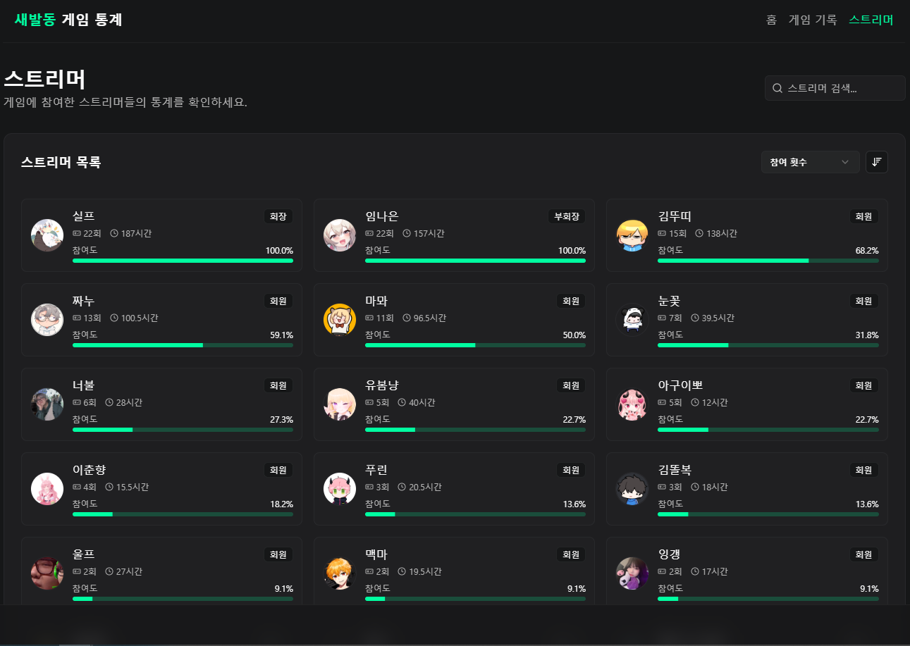

# 새발동 통계 사이트

## 💡 About

새발동 기록을 제공하는 사이트입니다.

참여 인원과 통계를 제공하고 경기 세부내역은 제공하지 않습니다!

## 🔧 주요 기능

- 일자별 새발동 기록
- 참여 스트리머 정보 및 참여 통계

## 🛠️ 기술 스택

- **프론트엔드**: Next.js
- **백엔드**: Nest.js
- **데이터베이스**: supabase(PostgreSQL)
- **기타**: Jenkins, Artififact Registry, GCP

## 📸 스크린샷

홈 화면

게임 기록

스트리머 정보

스트리머 상세 정보

## 🔗 사이트 주소

- [새발동 통계 사이트](https://saebaldong.kr)

## 💬 기능 추가 및 버그 제보

- che0189@gmail.com

## 🙏 도움 주신 분

- 게임 기록 제공 : AK
